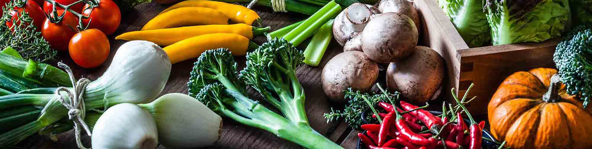

# food_classification
How does an unsupervised machine learning algorithm group foods? Will it follow USDA doctrine or come up with something else?

# Project Aims:
- Collect food nutritional information from the USDA database
- develop an unsupervised model to group individual foods
- Analyze the results of the classification

# Meta-Aims
- Practice data science skills learned in my bootcamp (unsupervised learning, data mining)
- learn new skills (containerization)

# Steps
 - Build an image containing everything needed for the project and publish to Dockerhub
 - Mine Data from USDA database https://fdc.nal.usda.gov/
 - Develop model
 - analyze
